\newpage
# 1. Intruduction 

## 1.1 Background

Our data set is the "Seoul Bike Sharing Demand Data Set", which on a high level contains hourly data for bike usage as well as various covariates that might be useful, e.g., temperature. Further, it contains around one year of data.

The data set has been aggregated and been uploaded to the UCI Machine Learning Repository, located here: http://archive.ics.uci.edu/ml/datasets/Seoul+Bike+Sharing+Demand

At first glance, relevant pieces are:

* Contains 8760 observations

* There are 14 columns

Regarding motivation for the data set and its potential use, the following is taken from the UCI website and was attached by the team that donated the data: "

"Currently Rental bikes are introduced in many urban cities for the enhancement of mobility comfort. It is important to make the rental bike available and accessible to the public at the right time as it lessens the waiting time. Eventually, providing the city with a stable supply of rental bikes becomes a major concern. The crucial part is the prediction of bike count required at each hour for the stable supply of rental bikes.

The dataset contains weather information (Temperature, Humidity, Windspeed, Visibility, Dewpoint, Solar radiation, Snowfall, Rainfall), the number of bikes rented per hour and date information."

## 1.2 Previous Work

There are two papers dealing with this data set explicitly. We're including both papers and in addition providing high level commentary on the paper and our concerns. 

### 1.2.1 Paper 1: VE, Park, and Cho (2020, Computer Communications), Using Data Mining Techniques 

**High Level:**

* Attempted to predict the hourly demand.

* Claims .96 R^2 and .92 R^2 for train and test, respectively. 

* Uses “Boruta” to identify important features, which underneath the hood uses random forest as part of the algorithm. 

* Considered linear regression, GBM, SVM’s (radial basis function), boosted trees, and xgboost; had a nice mathematical summary of each. 

**Thoughts/Concerns**

* Didn't consider L1 Regularization, i.e., LASSO, which seems the most obvious for feature importance/selection/ranking. For example, do the full path as we go over $\lambda$ and see the order they get dropped, where the sooner they drop the less important they are.

* Make no reference to how they split up into 75% train and 25% test, e.g., is it interleave of a specific calendar day and everything after is post? If interleaved, the the 75% train’s distribution and 25% test’s distribution are effectively identical and learning on the train portion is considered “cheating” since data has leaked. 

* Didn't consider non-linear transforms of the data, which may not be that important given the usage of decision trees, but could have allowed plain linear regression to perform better.

### 1.2.2 Paper 2: VE and Cho (2020, European Journal of Remote Sensing), A Rule-Based Model

**High Level**

* Consider CUBIST, regularized random forest, CART, KNN, Conditional Inference Tree.

* Almost identical to previous paper. 

* They had an additional data source, the “Capital Bikeshare program,” for which the dataset came from Kaggle. It didn’t seem that they used this in an “interesting” way (interleaving the data, using it as a validation) but instead just considered it as another data source for which they ran their same methodology and if they got the same R^2 and other metrics, then they'd consider that would be successful. 

**Thoughts/Concerns**

* Still don’t talk about train/test split methodology. 

* The last bullet point of high level thoughts. 

## 1.3 Scope and Goal

Based on the description above, we break it into two potential business requirements here:

* Predict next day hourly demand based on historical data until the current day.

* Real-time prediction for next hour demand based on historical data until the current hour.

The scope in this study is to:

* Re-define training and testing data with anchor time.

* Re-evaluate estimation methods with data splitting by anchor time.

* Build forecasting models to predict the next hour demand and compare the models in terms of prediction accuracy, prediction variance, running time, etc.

\newpage
# 2. Data Exploratory

## 2.1 Seoul Bike Sharing Demand Data
* Downloaded the data from the [UCI Machine Learning Repo](https:/http://archive.ics.uci.edu/ml/datasets/Seoul+Bike+Sharing+Demand).
* Contains 8760 measurements of number of bikes rented over 364.958 days.

Features of the data are,

* `DateTime`
* `RentedBikeCount`
* `Temp`, in Celsius.
* `Humidity`, in percent, max of 100.
* `Windspeed`
* `Visibility` out to 10 meters.
* `DewPointTemp`, in Celsius.
* `SolarRadiation`
* `Rainfall`, in mm.
* `Snowfall`, in cm.
* `Seasons`, a factor with levels {Winter, Spring, Summer, Autumn}.
* `Holiday`, a factor with levels {Holiday, No holiday}.
* `FunctionalDay`, a factor with levels {NoFunc(Non Functional Hours), Fun(Functional hours)}

## 2.2 Time Series Data

Fundamentally, our data is time-series data (Figure 2.1). As such, let $x_t$ be the time series we're working to model, i.e., Seoul's bike sharing data. 

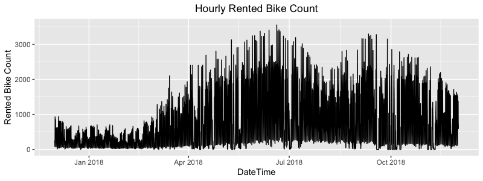
*Figure 2.1 plotting over entire time period*

### 2.2.1 Stationarity

It's arguable that there might be a strong seasonality component (less in winter more in summer), but that's hard to ascertain here since we only have one year's of data and only have one cycle. Further, there might be strong seasonality on an intraday basis (less in early morning and ramp up afterwards). If there was a strong seasonality component, we'd say our data isn't stationary, since on a first order basis, $E(x_t)$ will be dependent on $t$. Stationarity is important for a multitude of reasons, including *averaging being meaningful* and any *conditional expectation model we build is stable*.

Note, we can still incorporate terms to make a time series stationary, e.g., trend-stationary. 

We can test this directly using the Augmented Dickey-Fuller (ADF) Test (Figure 2.2), which intuitively tests for the presence of a unit root, which implies non-stationarity. $H_0$ for ADF is that $x_t$ is non-stationary, and $H_a$ is that $x_t$ is stationary. Note there are different types of stationarity, e.g., in presence of drift ($\mu$) or linear trend ($\beta t$). 

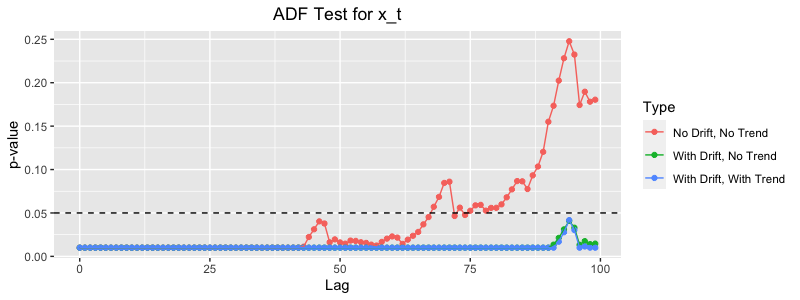

*Figure 2.2 stationarity test*

From this, we can note that we're relatively stationarity up to lag 40 under the relaxed condition of having drift.

### 2.2.2 ACF and PACF of $x_t$

We look at ACF and PACF of $y_t$ up to 100 and 50 lags (Figure 2.3), to see if any simple models come to mind. 

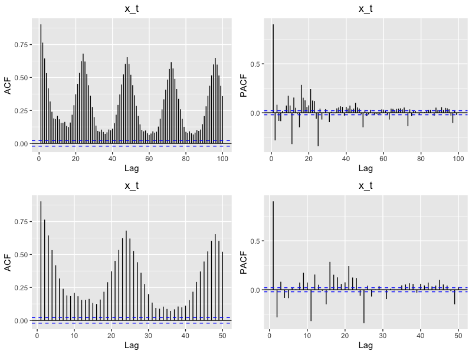
*Figure 2.3 ACF and PACF*

Math theory states that an AR($p$) model would have a hard cutoff to zero in the PACF plot for $h > p$, and a MA($q$) model would have a hard cutoff to zero in the ACF plot for $h > q$. From the ACF plot and seeing statistically significant autocorrelations all the way out, a simple MA($q$) model will not suffice. Looking at the PACF plot, we see a strong "cut-off" at around lag 25, suggesting an AR($25$) model. Needless to say, an AR($25$) model isn't very palatable and doesn't seem parsimonious. As such, we seemingly can't get away with a simple MA($q$) nor a simple AR($p$) model.

## 2.3 Feature Attributes

### 2.3.1 Hourly Trend

Plot below is showing the mean hourly demand by season (Figure 2.4). It is clear that winter season has much lower demand and summer season has relatively higher. Hourly trend is similar in each season with two peak time per day - 8 AM and 6 PM. The hour information could be used as either qualitative or quantitative since demand is not linearly related to hour. 

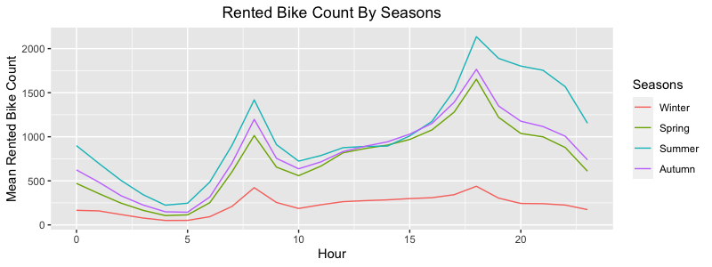
*Figure 2.4 Demand by Hour and Season*

### 2.3.2 Qualitative Variables

* The plots shows more rented bike count in non-holidays than holidays except for summer (Figure 2.5).

* If functional day is "no", there's no any bike rented (Figure 2.6).  

* Day of week is not making significant difference in rented bike count (Figure 2.7).

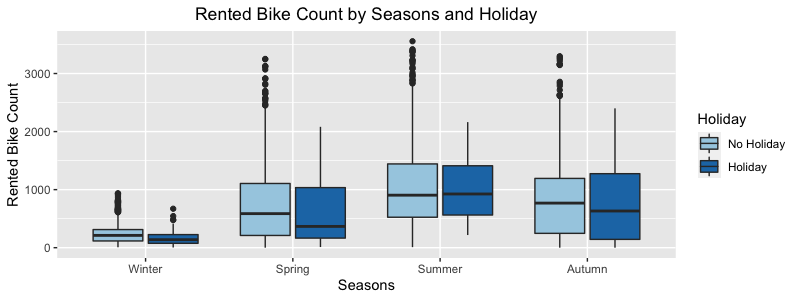
*Figure 2.5 Demand by Holiday and Season*

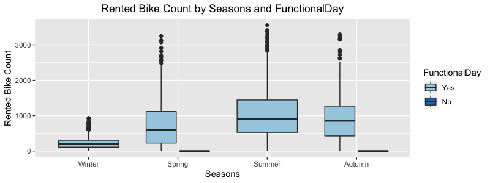
*Figure 2.6 Demand by Seasons and FunctionalDay*

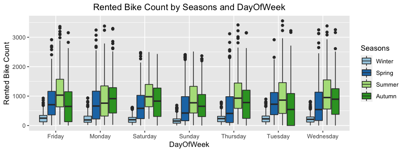
*Figure 2.7 Demand by by Seasons and DayOfWeek*

### 2.3.3 Quantitative Variables

Figure 2.8 and Figure 2.9 are showing correlations between quantitative variables and demand:

* The covariance matrix shows Temp, Hour has relatively higher correlation with RentedBikeCount (>0.4).

* DewPointTemp and SolarRadiation have correlation greater than 0.2. 

* Temp and DewPointTemp are highly correlated (0.9). 

* **No clear linear relationship can be identified between response variable and quantitative Variables**

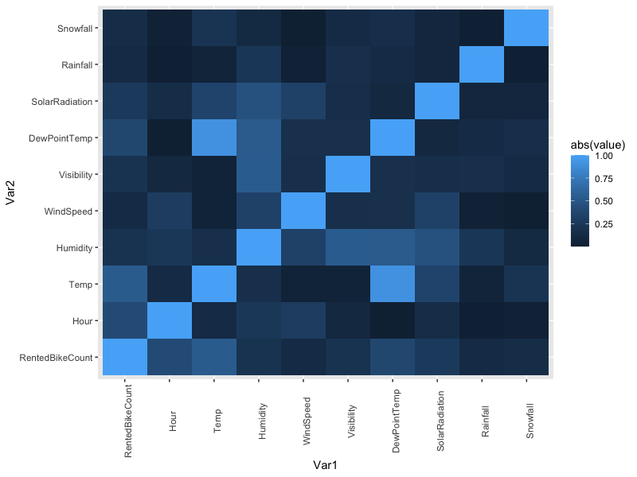
*Figure 2.8 Variable Correlation Matrix*

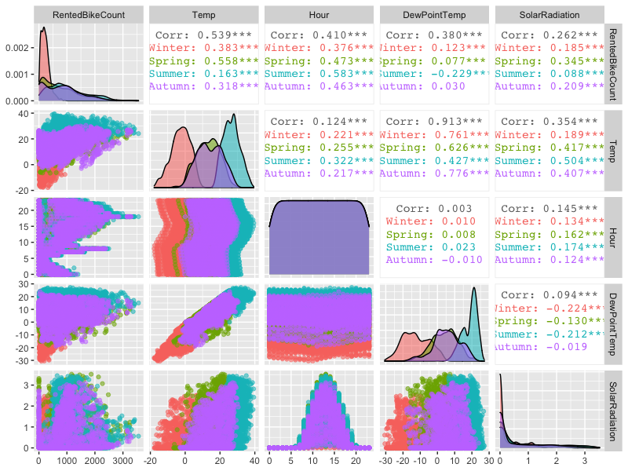
*Figure 2.9 Top 4 Variable Correlation Matrix*

## 2.4 Splitting Training and Testing Data

The data set includes one year hourly bike rented count from Dec 2017 to Nov 2019. Splitting training and testing data in any anchor date will cause incomplete yearly distribution and information loss in training data. For example, there are only two days' observations for non-functional day before September 2018, which leaves little evidence for the model to identify the impact of Functional Day during training process if setting anchor date prior to September.

To minimize the information loss and maximize the training data size available, the testing anchor date and time will be set no earlier than November 1, 2018:

* Feature distributions are close to all year distribution (See 2.4.1 and 2.4.2).

* Preliminary model testing shows the best result when using Nov 2018 data for testing (Chapter 3).

### 2.4.1 Weather Information Distribution

Figure 2.10 and 2.11 below are comparing distributions of some weather features for all observations and subset of observations before September 1, October 1 and November 1, 2018. In general, the last subset (setting anchor day at November 1, 2018) has a close enough distribution comparing the one year data set.

*Figure 2.10 Temp, Humidity and WindSpeed Distribution*

*Figure 2.11 Visibility and DewPointTemp Distribution*

### 2.4.2 Function Day and Holiday Distribution

Tables below are showing number of observations by category in each data set. The last data set (setting anchor day at November 1, 2018) has the closest percentage comparing to the one year data. 

*Table 2.1 Number of Observations by Season*

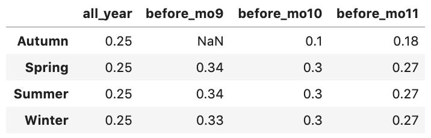

*Table 2.2 Number of Observations by Holidays*

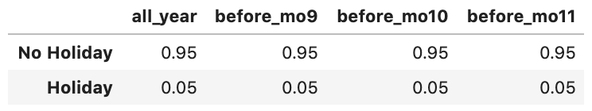

*Table 2.3 Number of Observations by Function Day*

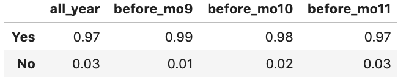

\newpage

# 3. Estimation Methods Comparison

TODO: report 004 

\newpage
# 4. Forecasting Model Comparison

There are three models considered to predict the next hour demand.(Assume the current day is X, and current hour is Y). 

* Model 1: One-time prediction for day X hourly demand by end of day X-1 with data updated to day X-1. 

* Model 2: Real-time model training to predict next hour (Y+1) demand with data updated to day X hour Y.

* Model 3: Continuous model training based on Model 1 and updated data from hour 1 to Y on day X. 

Testing data setting:

* Randomly select n(5 - 10 depends on run time) days as anchor days from Nov 2018:

  * For each anchor day, all observations prior to this anchor day is considered as training data.

  * For each anchor day, the next 24 hour observations is considered as testing data for Model 1.

  * There are n sets of training and testing data sets.

* Each anchor day selected above will have 24 sets of training and testing data based on anchor hour (Model 2 & Model 3).

* Or randomly select m anchor hours for each anchor day selected above (if run time becomes a consideration).

## 4.1 Model 1: One-time Prediction

## 4.2 Model 2: Real-time Model Training

## 4.3 Model 3: Continuous Model Training

## 4.4 Model Comparison

\newpage
# 5. Result and Conclusion 

