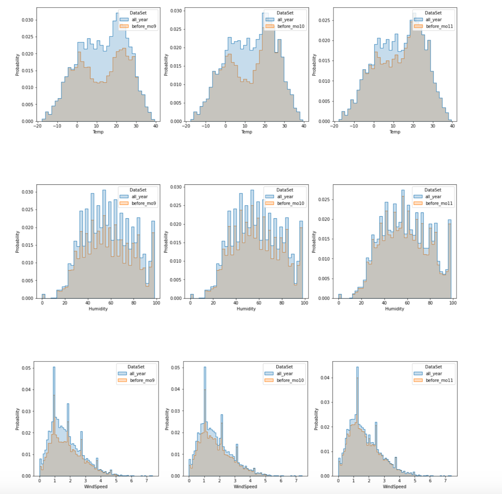
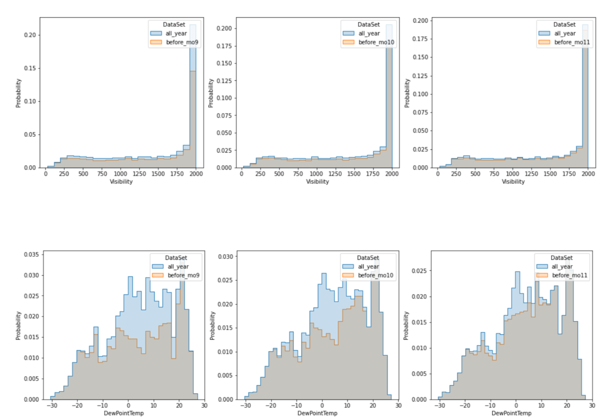

```{r packages, message=FALSE, echo=FALSE}
rm(list=ls())

knitr::opts_chunk$set(echo = TRUE, fig.height = 3, out.extra = "")

require(tidyverse)
require(dplyr)
require(caret) 
require(glmnet)
require(doParallel)
require(earth)
require(vip)
require(ranger)
require(xgboost)
require(RANN)
require(lubridate)
require(flipTime)
require(e1071)
require(latex2exp)
require(aTSA)
require(forecast)
require(reshape2)
require(GGally)
require(Ckmeans.1d.dp)
require(kableExtra)

theme_update(plot.title = element_text(hjust = 0.5))
```

\newpage
\newpage

\pagenumbering{roman}
\setcounter{page}{2}

\tableofcontents
\newpage
\listoffigures
\listoftables
\newpage

\pagenumbering{arabic}

\section{Introduction}

```{r data_setup, cache=TRUE, message=FALSE, echo=FALSE}
set.seed(1)

# Loading the Data
datPath = paste0(dirname(getwd()), "/data/SeoulBikeData.csv")
colNames = c("Date", "RentedBikeCount", "Hour", "Temp", "Humidity", 
             "WindSpeed", "Visibility", "DewPointTemp", "SolarRadiation",
             "Rainfall", "Snowfall", "Seasons", "Holiday", "FunctionalDay")
dat = read_csv(datPath, col_names = colNames, skip=1)

# Setting up Factors
dat$Hour = as_factor(dat$Hour)
dat$Seasons = as_factor(dat$Seasons)
dat$Holiday = as_factor(dat$Holiday)
dat$FunctionalDay = as_factor(dat$FunctionalDay)

# Creating DateTime that incorporates both Date and Hours and dropping Hour
dat$Date = AsDateTime(dat$Date) + hours(dat$Hour)

# We consider our "train" dataset all that we have, i.e., the total, for which we'll split later. 
Xtot = dat %>% select(-RentedBikeCount, -Date)
Ytot = dat %>% pull(RentedBikeCount)

# Partitioning
anchorDate = "2018/11/01"
learnNdx = dat$Date < anchorDate

yl = Ytot[learnNdx]
yt = Ytot[!learnNdx]
xl = Xtot[learnNdx,]
xt = Xtot[!learnNdx, ]

# Qualtitative Features
featureLevels = sapply(xl, function(x) { length(unique(x)) })
#head(sort(featureLevels), 5)

# Missing Data
featureNA   = head(sort(sapply(xl, function(x) { sum(is.na(x) )}), decreasing = TRUE))
obsNA       = head(sort(apply(xl, 1, function(x) { sum(is.na(x) )}), decreasing = TRUE))
naSummaryDf = data.frame(featureNA=featureNA, obsNA=obsNA, row.names = 1:length(obsNA))

# Data Normalization
# ---------------------------------------
# Identifying qualitative features
# ---------------------------------------
qualFeatures = which(featureLevels < 30)

xlQuant = xl %>% select(-all_of(qualFeatures))
xlQual  = xl %>% select(all_of(qualFeatures))
xtQuant = xt %>% select(-all_of(qualFeatures))
xtQual  = xt %>% select(all_of(qualFeatures))

# ---------------------------------------
# Center/Scale of Quantitative Features
# ---------------------------------------
ppStandardization = preProcess(xlQuant, method=c("center", "scale"))
xlQuantPost = predict(ppStandardization, xlQuant)
xtQuantPost = predict(ppStandardization, xtQuant)

# ---------------------------------------
# Creating Dummary Variables 
# ---------------------------------------
ppDummy = dummyVars(~ ., data = xlQual, fullRank = TRUE)

xlQualPost = predict(ppDummy, xlQual)
xtQualPost = predict(ppDummy, xtQual)

# ---------------------------------------
# Getting a singular matrix now
# ---------------------------------------
xlFull = cbind(xlQuantPost, xlQualPost)
xtFull = cbind(xtQuantPost, xtQualPost)

xlFullMat = as.matrix(xlFull)
xtFullMat = as.matrix(xtFull)

# Correlation Amongst the Features
corMat = cor(xlFull)
absCorMat = abs(corMat)[upper.tri(corMat)]
#round(quantile(absCorMat, c(0.5, 0.75, 0.9, 0.95, 0.99, 1)), 3)

# Identifying outliers
pcaOut = prcomp(xlFull, center=FALSE, scale=FALSE)
#pcaOut$x[,1:2] %>% as.data.frame %>% ggplot() +
#  geom_point(aes(x=PC1, y=PC2))

# Setting up multi-cluster
cl = makeCluster(6)
registerDoParallel(cl)

trControl = trainControl(method = "cv", number = 10)
```

\subsection{Background}

Our data set is the "Seoul Bike Sharing Demand Data Set", which on a high level contains hourly data for bike usage as well as various covariates that might be useful, e.g., temperature. Further, it contains around one year of data.

The data set has been aggregated and uploaded to the UCI Machine Learning Repository (\cite{Dua2019, epc20, ec20}). Further, the data contains 8760 observations, one supervisor, and 13 covariates. 

Regarding motivation for the data set and its potential use, the following is taken from the UCI website and was attached by the team that donated the data: 

\begin{displayquote}
Currently Rental bikes are introduced in many urban cities for the enhancement of mobility comfort. It is important to make the rental bike available and accessible to the public at the right time as it lessens the waiting time. Eventually, providing the city with a stable supply of rental bikes becomes a major concern. The crucial part is the prediction of bike count required at each hour for the stable supply of rental bikes.
\end{displayquote}

\subsection{Previous Work}

@epc20 looked at the same bike sharing data and looked at different learning algorithms on the original covariates in order to optimize prediction, using squared error as their evaluation metric. Different learning algorithms they look at include linear regression, gradient boosting machine, support vector machines with radial basis functions, as well as xgboost (an extension of gradient boosting machine). Ultimately, their best results were $R_{\text{train}}^2 = 0.96$ and $R_{\text{test}}^2 = 0.92$ using xgboost.

@ec20 only varies marginally from @epc20 in that they have an additional data set they consider, which they don't use as additional test data but instead run their same methodology on the Seoul bike sharing data and seeing if they get similar results. They do look at different learning algorithms, including CUBIST, random forest, CART, KNN, and conditional inference trees. 

Our primary concern with previous work is that they don't make any reference to how they split up their 75% train and 25% test, e.g., is it randomly chosen interleaved train and test or is it a specific calendar day and everything after is test and everything prior is train? If interleaved, then the 75% training data’s distribution and 25% test data's distribution are effectively identical and learning on the train portion can be deemed as data leakage, since data has leaked from the test portion indirectly. 

Also, from a learning methodology, they don't consider $L_1$ regularization directly when using linear regression. Further, they don't consider non-linear transforms of the data, which may not be that important given the usage of decision trees, but could have allowed plain linear regression to perform better.

\subsection{Scope and Goal}

Initially, we consider two business requirements:

1. Predict next day hourly demand based on historical data until the current day.
2. Real-time prediction for next hour demand based on historical data until the current hour.

Further, we also consider:

1. Redefine training and testing data with a notion of a strict anchor time, i.e., no interleaving.
2. Reevaluate learning algorithms with data splitting by anchor time.
3. Improve the forecasting by considering the correlation structure of bike rental demand.
4. Test forecasting models under different business requirements.


\newpage
\section{Exploratory Data Analysis}

\subsection{Seoul Bike Sharing Demand Data}

As mentioned earlier, we downloaded the data from the [UCI Machine Learning Repo](https:/http://archive.ics.uci.edu/ml/datasets/Seoul+Bike+Sharing+Demand) and it contained 14 measurements, split as 13 covariates and one supervisor, the rented bike count.

```{r describeFeatures, cache=TRUE, message=FALSE, echo=FALSE}
featureDescDf = data.frame(
   features=c("DateTime", "RentedBikeCount", "Hour", "Temp", "Humidity",
              "Windspeed", "Visibility", "DewPointTemp", "SolarRadiation",
              "Rainfall", "Snowfall", "Seasons", "Holiday", "FunctionalDay"),
   type=c("Date Time", "Numeric", "Numeric", "Numeric", "Numeric", "Numeric",
          "Numeric", "Numeric", "Numeric", "Numeric", "Numeric", 
          "Factor (4 Levels)", "Factor (2 Levels)", "Factor (2 Levels)"))

featureDescDf %>% 
   kable(col.names = c("Variable", "Data Type")) %>%
   row_spec(0, bold=TRUE) %>% 
   kable_styling()
```


\subsection{Time Series Data} \label{timeseriesdata}

Fundamentally, our data is time-series data (Figure \@ref(fig:ytDataPlot)). As such, let $y_t$ be the time series we're working to model, i.e., Seoul's bike sharing data. 

```{r ytDataPlot, cache = TRUE, dependson = 'data_setup', fig.cap="Hourly Rented Bike Count Over Entire Time Period", echo=FALSE}
dat %>% 
  ggplot(aes(x=Date, y=RentedBikeCount)) +
  geom_line() +
  labs(y="Rented Biked Count", "Date Time (Hour)")
```

\subsubsection{Stationarity}

It's arguable that there might be a strong seasonality component (less in winter more in summer), but that's hard to ascertain here since we only have one year's of data and only have one cycle. Further, there might be strong seasonality on an intraday basis (less in early morning and ramp up afterwards). If there was a strong seasonality component, we'd say our data isn't stationary, since on a first order basis, $E(y_t)$ will be dependent on $t$. Stationarity is important for a multitude of reasons, including *averaging being meaningful* and any *conditional expectation model we build is stable*.

Note, we can still incorporate terms to make a time series stationary, e.g., trend-stationary. 

We can test this directly using the Augmented Dickey-Fuller (ADF) Test, which intuitively tests for the presence of a unit root, which implies non-stationarity [@Greene2003Econometric]. $H_0$ for ADF is that $y_t$ is non-stationary, and $H_a$ is that $y_t$ is stationary. Note there are different types of stationarity, e.g., in presence of drift ($\mu$) or linear trend ($\beta t$). 

```{r ytAdfPlot, cache = TRUE, dependson = 'data_setup', fig.cap="Augmented Dickey Fuller (ADF) Test for Stationarity", echo=FALSE}
zz = adf.test(dat$RentedBikeCount, 100, output=FALSE)
adf1 = zz[[1]] %>% data.frame %>% mutate(Type="No Drift, No Trend")
adf2 = zz[[2]] %>% data.frame %>% mutate(Type="With Drift, No Trend")
adf3 = zz[[3]] %>% data.frame %>% mutate(Type="With Drift, With Trend")
adfDat = bind_rows(adf1, adf2, adf3)

adfDat %>% ggplot(aes(x=lag, y=p.value, color=Type)) +
  geom_point() +
  geom_line() +
  geom_hline(yintercept=0.05, linetype="dashed", color = "black") +
  labs(x="Lag", y="p-value")
```

Note that each lag, i.e., tick mark, in the ADF figure represents an hour. Under the most relaxed condition of no drift and no trend, then we can see that we start getting significant non-stationarity post lag 48, which represents approximately two days past. While this can be handled by differencing, as suggested by the stationarity for more restrictive conditions, this can also suggest that we can include lagged covariates of the response, i.e., lagged $y_t$, which we will ascertain next when looking at the auto-correlation function (ACF) plots and the partial auto-correlation function (PACF) plots. 


\subsubsection{Autocorrelation and Partial Autocorrelation of Rented Biked Count, $y_t$}

The ACF looks at correlation of $y_t$ with lagged versions of itself, e.g., $y_{t-k}$, while the PACF differs in that it looks at correlation of $y_t$ with lagged versions of itself, e.g., $y_{t-k}$, while controlling for the intermediary lags, e.g., $\tilde{\bs{y}} = \{y_{t-1}, y_{t-2}, \dots, y_{t-k+1}\}$ [@boxjen76]. From a practical standpoint, when considering PACF, we regress $y_t$ on $\tilde{\bs{y}}$ and $y_{t-k}$ on $\tilde{\bs{y}}$, and then look at the correlation of their respective residuals. 

Here, we look at the ACF and PACF of $y_t$ up to 100 and 50 lags.

```{r ytAcfPacf, cache = TRUE, dependson = 'data_setup', fig.cap="Autocorrelation and Partial Autocorrelation of Rented Bike Count, i.e., $y_t$", echo=FALSE}
selfACF   = ggAcf(dat$RentedBikeCount, lag.max = 100) + labs(title=TeX("$y_t$"))
selfPACF  = ggPacf(dat$RentedBikeCount, lag.max = 100) + labs(title=TeX("$y_t$"))
selfACF2  = ggAcf(dat$RentedBikeCount, lag.max = 50) + labs(title=TeX("$y_t$"))
selfPACF2 = ggPacf(dat$RentedBikeCount, lag.max = 50) + labs(title=TeX("$y_t$"))

plots = list(selfACF, selfPACF, selfACF2, selfPACF2)
gridExtra::grid.arrange(grobs = plots, ncol=2)
```


Math theory states that an AR($p$) model would have a hard cutoff to zero in the PACF plot for $h > p$, and a MA($q$) model would have a hard cutoff to zero in the ACF plot for $h > q$ [@schumway01timeseries]. From the ACF plot and seeing statistically significant autocorrelations all the way out, a simple MA($q$) model will not suffice. Looking at the PACF plot, we see a strong "cut-off" at around lag 25, suggesting an AR($25$) model. Needless to say, an AR($25$) model isn't very palatable and doesn't seem parsimonious. As such, we seemingly can't get away with a simple MA($q$) nor a simple AR($p$) model.

While we can't get a simple AR($p$) or MA($q$) model, we can still use the results of the ACF and PACF plots to suggest that we need lagged values of our supervisor as additional covariates.


\subsection{Feature Attributes}


\subsubsection{Hourly Trend}

Figure \@ref(fig:ytHourlyBySeasons) shows the mean hourly demand by season. It is clear that winter season has much lower demand and summer season has relatively higher demand. Hourly trend is similar in each season with two peak time per day - 8 AM and 6 PM. The hour information could be used as either qualitative or quantitative since demand is not linearly related to hour. 

```{r ytHourlyBySeasons, cache = TRUE, dependson = 'data_setup', fig.cap="Rented Bike Count by Hour Grouped by Seasons", echo=FALSE}
# plotting "effect" of seasons
dat %>% 
  mutate(Hour = hour(Date)) %>%
  group_by(Seasons, Hour) %>%
  summarise(MeanRentedBikeCount = mean(RentedBikeCount), .groups="drop") %>%
  ggplot(aes(x=Hour, y=MeanRentedBikeCount, color=Seasons)) +
  geom_line() +
  labs(y="Mean Rented Bike Count", x="Hour")  
```


\subsubsection{Qualitative Variables}

Grouping by the qualitative variables, i.e., the factors, note:

* Figure \@ref(fig:ytBySeasonsByHoliday) shows more rented bike count in non-holidays than holidays except for summer.
* If functional day is "no", there's not any bike rentals (Figure \@ref(fig:ytBySeasonsByFunctionalDay)).  
* Considering seasons and grouping by day of week, rented bike count by seasons isn't significantly affected by day of week (Figure \@ref(fig:ytByDayOfWeekBySeasons)).

```{r ytBySeasonsByHoliday, cache = TRUE, dependson = 'data_setup', fig.cap="Rented Bike Count by Season Grouped by Holiday", echo=FALSE}
dat %>% 
  ggplot(aes(x=Seasons, y=RentedBikeCount, fill=Holiday)) + 
  geom_boxplot() +
  scale_fill_brewer(palette="Paired") +
  labs(y="Rented Bike Count", x="Seasons") 
```

```{r ytBySeasonsByFunctionalDay, cache = TRUE, dependson = 'data_setup', fig.cap="Rented Bike Count by Season Grouped by Functional Day", echo=FALSE}
dat %>% 
  ggplot(aes(x=Seasons, y=RentedBikeCount, fill=FunctionalDay)) + 
  geom_boxplot() +
  scale_fill_brewer(palette="Paired") +
  labs(y="Rented Bike Count", x="Seasons")
```


```{r ytByDayOfWeekBySeasons, cache = TRUE, dependson = 'data_setup', fig.cap="Rented Bike Count by Day of Week Grouped by Season", echo=FALSE}
dat$DayOfWeek <- weekdays(dat$Date)

dat %>% 
  ggplot(aes(x=DayOfWeek, y=RentedBikeCount, fill=Seasons)) + 
  geom_boxplot() +
  scale_fill_brewer(palette="Paired") +
  labs(y="Rented Bike Count", x="DayOfWeek")
```


\subsubsection{Quantitative Variables}


Figure \@ref(fig:xtCorr) and Figure \@ref(fig:xtCorrBySeason) are showing correlations between quantitative variables and demand, for which we can note that:

* The covariance matrix shows `Temp`, `Hour` have relatively higher correlation with `RentedBikeCount` ($\rho_{x,y} > 0.4$).
* `DewPointTemp` and `SolarRadiation` have correlation greater than 0.2 ($\rho_{x,y} > 0.2$). 
* `Temp` and `DewPointTemp` are highly correlated amongst each other $\rho_{x_1,x_2} > 0.9$). 
* Since we don't see any covariate with $\rho_{x,y} > 0.5$, we state that there are no clear linear relationships between the supervisor and quantitative covariates.

```{r xtCorr, cache = TRUE, dependson = 'data_setup', fig.cap="Covariates Correlation Matrix", echo=FALSE, fig.height=5} 
quantitative_var = c("Hour", "Temp", "Humidity", "WindSpeed", "Visibility", "DewPointTemp", 
             "SolarRadiation", "Rainfall", "Snowfall")

# check covariance  
cor_matrix = cor(dat[c("RentedBikeCount", quantitative_var)] %>% sapply(as.numeric))
cor_matrix2 = melt(cor_matrix)

cor_matrix2 %>% 
  ggplot(aes(x=Var1, y=Var2, fill=abs(value))) + 
  geom_tile() +
  scale_fill_gradient(low = "white", high = "red") +
  labs(x="", y="") +
  theme(axis.text.x = element_text(angle = 90))
```

```{r xtCorrBySeason, cache = TRUE, dependson = 'data_setup', fig.cap="Top Four Covariates Correlation Matrix By Season", echo=FALSE, message=FALSE,fig.height=6, fig.width=8} 
cor_matrix = cor_matrix[order(abs(cor_matrix[,1]), decreasing=TRUE),]

# scatter plot matrix
select_var = rownames(cor_matrix)[1:5]
df_select_var = dat[select_var] %>% sapply(as.numeric) %>% data.frame

df_select_var %>%
  ggpairs(aes(colour = dat$Seasons, alpha = 0.2),
          upper = list(continuous = wrap("cor", size = 3)))
```


\subsection{Splitting Training and Testing Data}

The data set includes hourly bike rented count spanning a little over a year, from Dec 2017 to Nov 2018. Splitting training and testing data in any anchor date will cause incomplete yearly distribution and information loss in training data. For example, there are only two days for which $\texttt{FunctionalDay} = \texttt{No}$ before September 2018, which leaves little evidence for the model to identify the impact of `FunctionalDay` during training process if setting anchor date prior to September.

To maximize the training data size available while maintaining similar distributions, the testing anchor date and time will be set no earlier than November 1, 2018, where the training data feature distribution is close to all year feature distribution (See Figure \@ref(fig:distFig1)-\@ref(fig:distFig2) and Table \@ref(tab:distTab1)-\@ref(tab:distTab3)).

\subsubsection{Weather Information Distribution}

Figure \@ref(fig:distFig1) and \@ref(fig:distFig2) below are comparing distributions of some weather features for all observations and subset of observations before September 1, October 1 and November 1, 2018. In general, the last subset (setting anchor day at November 1, 2018) has a qualitatively close enough distribution relative to the entire distribution. 

```{r distFig1, fig.align = 'center', out.width = "90%", fig.cap = "Temp, Humidity and WindSpeed Distribution", cache = TRUE, dependson = 'data_setup',echo=FALSE, message=FALSE,fig.height=6, fig.width=8}

```

```{r distFig2, fig.align = 'center', out.width = "90%", fig.cap = "Visibility and DewPointTemp Distribution",cache = TRUE, dependson = 'data_setup',echo=FALSE, message=FALSE, fig.height=4, fig.width=8}

```

\subsubsection{Function Day and Holiday Distribution}

Tables (\@ref(tab:distTab1), \@ref(tab:distTab2) and \@ref(tab:distTab3)) are showing number of observations by category in each data set. The last data set (setting anchor day at November 1, 2018) has quantitatively the closest proportion of `FunctionalDay` relative to the entire, non-subsetted data.. 

```{r distTab1, cache = TRUE, echo=FALSE, message=FALSE}
dist_df1 = data.frame(all_year=c(0.25, 0.25, 0.25, 0.25), 
                      before_Sept=c(0.34, 0.34, NaN, 0.33),
                      before_Oct=c(0.3, 0.3, 0.1, 0.3),
                      before_Noc=c(0.27, 0.27, 0.18, 0.27))
rownames(dist_df1) <- c("Spring", "Summer", "Autumn", "Winter")
knitr::kable(dist_df1, 
             col.names = c("All Year", "Before Sept.", "Before Oct.", "Before Nov."),
             caption = "Percentage of Observations by Season") %>%
   row_spec(0, bold=TRUE) %>% 
   kable_styling()
```


```{r distTab2, cache = TRUE, echo=FALSE, message=FALSE}
dist_df2 = data.frame(all_year=c(0.95, 0.05), 
                      before_Sept=c(0.95, 0.05),
                      before_Oct=c(0.95, 0.05),
                      before_Noc=c(0.95, 0.05))
rownames(dist_df2) <- c("No Holiday", "Holiday")
knitr::kable(dist_df2, 
             col.names = c("All Year", "Before Sept.", "Before Oct.", "Before Nov."),
             caption = "Percentage of Observations by Holidays") %>%
   row_spec(0, bold=TRUE) %>% 
   kable_styling()
```

```{r distTab3, cache = TRUE, echo=FALSE, message=FALSE}
dist_df3 = data.frame(all_year=c(0.97, 0.03), 
                      before_Sept=c(0.99, 0.01),
                      before_Oct=c(0.98, 0.02),
                      before_Noc=c(0.97, 0.03))
rownames(dist_df3) <- c("Function Day", "Non-Function Day")
knitr::kable(dist_df3, 
            col.names = c("All Year", "Before Sept.", "Before Oct.", "Before Nov."),
             caption = "Percentage of Observations by Function Days") %>%
   row_spec(0, bold=TRUE) %>% 
   kable_styling()
```

\newpage

\section{Learning Algorithms}

On a high level, we wish to do supervised learning, i.e., learn the relationship, i.e., fit a model, between the supervisor $y$ (`RentedBikeCount` here) and its covariates such that we can make predictions $\hat{y}$ that perform well beyond our period of learning [@AIMA]. There are numerous learning algorithms we can consider and consequently we consider a subset containing both linear approaches and non-linear approaches. 

\subsection{Theoretical Methodology}

\subsubsection{Data}
We have a collection of observations housed in a matrix $\bs{X}$ that is $\rdim{n}{p}$, i.e., $n$ observations and $p$ covariates. Further, for each observation, we have an associated supervisor value, for which all the supervisor values are housed in a column vector $\bs{y}$ that is $\rdim{n}{1}$, i.e., $n$ supervisor values for each of the $n$ associated observation. 

\subsubsection{Risk}
We want to use training data and different algorithms to produce a $\hat{f}: \R^p \mapsto \R$, such that we can make predictions with $\hat{f}$, i.e., $\hat{f}(\bs{X}) = \hat{y}$, where $\bs{x} \in \R^p$ and $\hat{y} \in \R$, such that $\hat{y}$ is a \say{good} prediction of $y$, the unobserved supervisor. 

One way to define \say{good} is to define it in the context of \say{loss}, specifically $\ell (\hat{y}, y)$. There are a multitude of loss functions to consider, but a popular loss for regression is the squared error loss, i.e., $\ell (\hat{y}, y) = (\hat{y} - y)^2$, where deviations from the true $y$ value is penalized in a squared fashion [@berger1985statistical]. 

We define \say{good} to be the risk for $f$, namely $R(f) = \E \ell (f(\bs{X}), \bs{Y})$, noting that $\bs{X}, \bs{Y}$ are random variables \textbf{but} $R(f)$ isn't random, due to the expectation. In practice, we can use \say{test error} as an estimate for the risk. We can also use \say{cross-validation} as another estimate for the risk as well. 

\subsubsection{Identifying $f_*$ vs. $\hat{f}$}
Let $f_* = \argminA_{f} R(f)$, i.e., $f_*$ has the lowest risk among the entire family of possible $f$. But, $f_*$ is theoretical, since we don't know the entire joint distribution of $(\bs{X}, \bs{Y})$. As such, $\hat{f}$ is our best guess of $f_*$. 

\subsubsection{Summary}
In short, our goal is to consider different learning algorithms, \say{learn} the relationship between the data and the supervisor, and make the best predictions we can, as defined by jointly by our risk estimate and the embedded loss metric, squared error loss $\ell (\hat{y}, y) = (\hat{y} - y)^2$ in our case. We will estimate risk in two different ways, cross-validation to help guide our hyperparameter selection, and \say{test error} as the final hold-out to evaluate the \say{tuned} hyperparameters [@stone1974cross]. 


\subsection{Linear Methods}

\subsubsection{Linear Regression}

Let $\bs{\beta}^T, \bs{x}^T \in \R^p$, then we wish to model $y$ as $y = \bs{x}^T \bs{\beta} + \epsilon$, i.e., we want to project $y$ onto the subspace spanned by $\bs{X}$. In short, $\hat{\beta} = \argminA_\beta ||\bs{y} - \bs{X} \bs{\beta}||^2_2$ [@sheather01regression].

```{r fitLinearRegression, cache = TRUE, dependson = 'data_setup', echo=FALSE}
set.seed(1)
linearOut = train(x = xlFullMat, y = yl,
                  method = "lm",
                  trControl = trControl)

yhatLinear = predict(linearOut$finalModel, xlFull) %>%
  as.numeric()
```

```{r fitLinearRegressionResidualPlot, fig.cap="Residual Plot for Linear Regression", cache=TRUE, dependson='fitLinearRegression', echo=FALSE, fig.height=3}
data.frame(e=yl - yhatLinear, yhat = yl) %>%
  ggplot(aes(x=yhat, y=e)) +
  geom_point() +
  labs(x=TeX("$\\hat{y}$"), y=TeX("$\\hat{\\epsilon} = y - \\hat{y}$"))
```

From this residual plot, it suggests that multiple linear regression isn't appropriate for this data set. Namely, in an idealized setting, we wouldn't notice any distinct patterns in the residuals, but in this case, we see a clear increase in residual values as our estimate $\hat{y}$ gets larger. This may be due to the supervisor being count data, for which a Poisson regression or applying a square-root transform to the supervisor. 

To be more specific, for us to do inference using Linear Regression, independent of prediction, we need to have $\E{\epsilon} = 0$, $\V(\epsilon)$, and $\text{Cov}(\epsilon_i, \epsilon_j) = 0$, for which all three conditions aren't satisfied. This isn't a problem specifically for us, since we care about prediction, but it does suggest model misspecification. 


\subsubsection{Elastic Net}

From @Zou05regularizationand, Elastic Net is an extension of Linear Regression, where we do a mixture of both $L_1$ regularization (penalty of $||\bs{\beta}||_1$) and $L_2$ regularization (penalty of $||\bs{\beta}||^2_2$). Then,  $\hat{\beta}(\lambda_1, \lambda_2) = \argminA_\beta ||\bs{y} - \bs{X} \bs{\beta}||^2_2 + \lambda_1 ||\bs{\beta}||_1 + \lambda_2 ||\bs{\beta}||_2^2$. Note, another parameterization is having a singular $\lambda$ and a "mixing ratio" between $L_1$ and $L_2$ regularization in the form of $\alpha$. Then, $\hat{\beta}(\lambda, \alpha) = \argminA_\beta \big( ||\bs{y} - \bs{X}\bs{\beta}||^2_2 + \lambda ((1-\alpha)||\bs{\beta}||^2_2 + \alpha ||\bs{\beta}||_1) \big)$. In this parameterization, note that $\alpha=1$ results in LASSO, which has only $L_1$ regularization , and that $\alpha=0$ results in Ridge Regression, which has only $L_2$ regularization. 

An open question remains though on how to choose $\alpha$, the mixture between $L_1$ and $L_2$ regularization, and $\lambda$, how much penalty to impose. For this, we can choose hyperparameters with the lowest $k$-fold cross-validation risk estimates [@Efron04theestimation].

```{r fitElasticNet, cache = TRUE, dependson = 'data_setup', echo=FALSE}
set.seed(1)
lassoGrid = expand.grid(
  lambda = seq(0, 1.25, length.out = 20),
  alpha = c(0.01, 0.05, 0.25, 0.5, 0.75, 1))
elasticOut = train(x = xlFullMat, y = yl,
                   method="glmnet",
                   tuneGrid = lassoGrid,
                   trControl = trControl)
```

```{r fitElasticNetTrainPlot, cache = TRUE, dependson = 'fitElasticNet', fig.cap="Cross-Validation Risk Estimates for Elastic Net Hyperparameters", echo=FALSE, message=FALSE}
title1 = TeX("Mixing Percentage ($\\alpha$)")
ggplot(elasticOut, highlight = TRUE) +
   labs(x=TeX("Regularization Parameter ($\\lambda$)")) +
   scale_color_discrete(name=title1) +
   scale_shape_discrete(name=title1)
```

Looking at the cross-validation risk estimates, the minimal test error is at $\hat{\alpha} = `r elasticOut$bestTune$alpha`$ and $\hat{\lambda} = `r elasticOut$bestTune$lambda`$, suggesting that we prefer minimal $L_1$ regularization ($\alpha = 0$ is strictly $L_2$ reguarlization). 

Note we've run into a boundary condition, i.e., we don't know if having $\hat{\lambda} > `r elasticOut$bestTune$lambda`$ will result in an even lower risk estimate. As such, we expand past the boundary and see if we can get a lower risk estimate. 

```{r fitElasticNet2, cache = TRUE, dependson = 'data_setup', echo=FALSE}
set.seed(1)
lassoGrid = expand.grid(
  lambda = seq(0.75, 5, length.out = 20),
  alpha = c(0.01))
elasticOut = train(x = xlFullMat, y = yl,
                   method="glmnet",
                   tuneGrid = lassoGrid,
                   trControl = trControl)
```

```{r fitElasticNet2TrainPlot, cache = TRUE, dependson = 'fitElasticNet2', fig.cap="Cross-Validation Risk Estimates for Elastic Net Hyperparameters Past Boundary Condition", echo=FALSE, message=FALSE}
ggplot(elasticOut, highlight = TRUE) +
   labs(x=TeX("Regularization Parameter ($\\lambda$)"))
```

Thus, the hyperparameters that minimize the cross-validation risk estimate is  $\hat{\alpha} = `r elasticOut$bestTune$alpha`$ and $\hat{\lambda} = `r round(elasticOut$bestTune$lambda, 2)`$.


```{r fitElasticNet2_yhat, cache=TRUE, dependson='fitElasticNet2', echo=FALSE}
# Refitting with 'core' glmnet
glmnetOut     = glmnet(x = xlFullMat, y = yl, alpha = elasticOut$bestTune$alpha)
betaHatGlmnet = coef(glmnetOut, s = elasticOut$bestTune$lambda)
yhatGlmnet    = predict(glmnetOut, xlFullMat, s=elasticOut$bestTune$lambda) %>%
  as.numeric()
```

```{r fitElasticNet2ResidualPlot, cache=TRUE, dependson='fitElasticNet2', echo=FALSE, fig.height=3, fig.cap="Residual Plot for Elastic Net"}
data.frame(e = yl-yhatGlmnet, yhat = yl) %>%
  ggplot(aes(x=yhat, y=e)) +
  geom_point() +
  labs(x=TeX("$\\hat{y}$"), y=TeX("$\\hat{\\epsilon} = y - \\hat{y}$"))
```

Not surprisingly, the residual plot for Elastic Net shows similar behavior to Linear Regression, suggesting that Elastic Net isn't an appropriate model and further confirmation the linear models aren't appropriate for the problem we have. 


\subsection{Non-Linear Methods}

\subsubsection{Multivariate Adaptive Regression Splines (MARS)}

Per @Friedman91multivariateadaptive, Multivariate Adaptive Regression Splines (MARS) uses the linear regression framework but constructs features to model non-linearities and their interactions in an automated fashion. Specifically, in a foward-stepwise fashion, it looks over all $p$ covariates and a specified set of "knots" to identify the most relevant hinge feature to introduce, e.g., $I(x_j - \kappa_0) > 0$ and $I(x_j - \kappa_0 \leq 0)$. Further, it can introduce interactive features, e.g., $I(x_j - \kappa_0 > 0) \times I(x_k - \kappa_1 \leq 0)$. MARS then uses generalized cross-validation (GCV) to determine some ideal subset of features. 

As such, the number of knots to consider as well as the degree of interaction are the hyperparameters for MARS.

```{r fitMARS, cache = TRUE, dependson = 'data_setup', echo=FALSE}
set.seed(1)
tuneGrid = expand.grid(
  degree=1:3,                            # number of interactions
  nprune = c(5,10,15,20,25,30, 50, 100)) # number of knots

marsOut = train(x = xlFullMat, y = yl,
                method="earth",
                tuneGrid = tuneGrid,
                trControl = trControl)
```

```{r fitMARSPlot, cache = TRUE, dependson = 'fitMARS', fig.cap="Cross-Validation Risk Estimates for MARS Hyperparameters", echo=FALSE, message=FALSE}
title1 = TeX("Degree of Interaction")
ggplot(marsOut, highlight = TRUE) +
   labs(x=TeX("Number of Knots")) +
   scale_color_discrete(name=title1) +
   scale_shape_discrete(name=title1)
```

Here, we can see that as we increase the number of knots, the cross-validation risk estimates lower, eventually leveling off after 50 knots. Further, having interactions help, but there seem to be diminishing return as there's not a large difference between allowing 3-way interactions relative to 2-way interactions. 

```{r fitMARS_yhat, cache=TRUE, dependson='fitMARS', echo=FALSE}
yhatMARS = predict(marsOut$finalModel, xlFullMat) %>% as.numeric()
```

```{r fitMARSResidualPlot, cache=TRUE, dependson='fitMARS', echo=FALSE, fig.height=3, fig.cap="Residual Plot for MARS"}
data.frame(e = yl-yhatMARS, yhat = yl) %>%
  ggplot(aes(x=yhat, y=e)) +
  geom_point() +
  labs(x=TeX("$\\hat{y}$"), y=TeX("$\\hat{\\epsilon} = y - \\hat{y}$"))
```
Having introduced non-linearities in the form of covariates, we're still using a linear regression framework, i.e., $\beta$'s are linear, and as such, we can talk about residual plots. In this case, while there's still not random error and there's still a clear trend, it's not as pronounced as the previous strictly linear predictors. 

\subsubsection{Decision Tree}

Per @wires11, Decision Tree is an umbrella term for machine learning methods that recursively partitions the data and fits a simple prediction model at each partition, for which the results can be viewed as a decision tree. We specifically use a variant of CART [@cart001], which imposes a `cp`, complexity parameter, effectively specifying a minimal amount of improvement needed for each split, thus saving later tree pruning that is part of CART's regular routine [@rpart]. 

As such, the only hyperparmeter we have to consider is `cp`. 

```{r fitDT, cache = TRUE, dependson = 'data_setup', echo=FALSE}
set.seed(1)
tuneGrid = data.frame(cp=c(0, 0.001, 0.0025, 0.005, 0.01, 0.05, 0.1))
rpartOut = train(x = xlFull, y = yl,
                 method = "rpart",
                 tuneGrid = tuneGrid,
                 trControl = trControl)
```

```{r fitDTPlot, cache = TRUE, dependson = 'fitDT', fig.cap="Cross-Validation Risk Estimates for Decision Tree Hyperparameters", echo=FALSE}
ggplot(rpartOut, highlight = TRUE) +
   labs(x=TeX("Complexity Parameter (cp)")) 
```

Here, we can see that as we increase the hyperparameter `cp`, the cross-validation risk-estimate is increasing. This suggests that our best tree is a fully growned decision tree and that any pre-pruning with `cp` would be detrimental. 

```{r fitDT_yhat, cache=TRUE, dependson='fitDT', echo=FALSE}
yhatDT = predict(rpartOut$finalModel, xlFull)
```

```{r fitDTResidualPlot, cache=TRUE, dependson='fitDT', echo=FALSE, fig.height=3, fig.cap="Residual Plot for Decision Tree"}
data.frame(e = yl-yhatDT, yhat = yl) %>%
  ggplot(aes(x=yhat, y=e)) +
  geom_point() +
  labs(x=TeX("$\\hat{y}$"), y=TeX("$\\hat{\\epsilon} = y - \\hat{y}$"))
```

At this point, it may not be meaningful to do in-sample residual plots due to the induced non-linearities.

\subsubsection{Random Forest}

Random Forest is an ensemble of trees, where for each tree we use a bootstrap of our original data and further for each decision node for that tree, we only consider a subset of covariates, e.g., $\sqrt{p}$. The motivation for Random Forest is that Decision Trees are low bias high variance procedures and by doing the aforementioned approach, we're able to maintain the bias but lower the variance [@Breiman01randomforests]. 

We fix the number of trees in the ensemble to be $500$, and the hyperparameters we consider are `mtry`, which specifies the number of covariates to use, and `min.node.size`, which specifies the minimum amount of observations in a terminal node. 


```{r fitRf, cache = TRUE, dependson = 'data_setup', echo=FALSE}
set.seed(1)
tuneGrid = expand.grid(splitrule="variance",
                       mtry = round(ncol(xlFullMat) ** c(0.25, 0.5, 0.75, 0.9, 0.95)),
                       min.node.size = round(nrow(xlFullMat) * c(0.0001, 0.001, 0.01)))
rangerOut = train(x = xlFullMat, y = yl,
                  method = "ranger",
                  tuneGrid = tuneGrid,
                  num.trees = 500,
                  trControl = trControl)
```

```{r fitRfPlot, cache = TRUE, dependson = 'fitRf', fig.cap="Cross-Validation Risk Estimates for Random Forest Hyperparameters", echo=FALSE, message=FALSE}
title1 = TeX("Minimal Node Size")
ggplot(rangerOut, highlight = TRUE) +
   labs(x=TeX("Number of Randomly Selected Covariates (mtry)")) +
   scale_color_discrete(name=title1) +
   scale_shape_discrete(name=title1)
```

Thus, the hyperparameters that minimize the cross-validation risk estimate is  $\texttt{mtry} = `r rangerOut$bestTune$mtry`$ and $\texttt{min.node.size} = `r rangerOut$bestTune$min.node.size`$. 

```{r fitRf_yhat, cache=TRUE, dependson='fitRf', echo=FALSE}
yhatRf = predict(rangerOut, xlFull)
```

\subsubsection{Boosting} \label{boostinghyperparameters}

From @Friedman98additivelogistic, Boosting is a forward stagewise additive model in a set of elementary \say{basis} functions, e.g., weak classifiers $G_m(\bs{x}) \in \{-1,1\}$. Mathematically, we can frame this as $f(\bs{x}) = \sum_{b=1}^B \beta_b b(\bs{x}; \gamma_m)$, where $\beta_m$ are the expansion coefficients, and $b(\bs{x};\gamma) \in \R$ are simple functions of multivariate argument $\bs{x}$ and characterized by $\gamma$ [@hastie01statisticallearning]. 

XGBoost is a popular implementation of Boosting that also extends it to be computationally faster as well as more scaleable, across multiple cores as well as multiple computers [@Chen16xgboost]. 

Assuming we use a decision tree as our \say{basis} function, hyperparameters we consider are how many rounds of boosting (`nrounds`), the maximum depth of the tree (`max_depth`), and what fraction of covariates to consider per tree (`colsample_bytree`), similar to Random Forest. 

```{r fitBoosting, cache = TRUE, dependson = 'data_setup', echo=FALSE, message=FALSE, warning=FALSE}
nBoostingThreads = 6

set.seed(1)
tuneGrid = expand.grid("nrounds" = c(100, 150, 200, 300, 400, 500, 750),
                       "max_depth" = c(1, 2, 4, 6, 8),
                       "eta" = c(0.01),
                       "gamma" = 0,
                       "colsample_bytree" = c(.5, .75, 1),
                       "min_child_weight" = 0,
                       "subsample" = 0.5)

boostOutObjSe = train(x=xlFullMat, y = yl,
                      method="xgbTree",
                      objective = "reg:squarederror",
                      tuneGrid = tuneGrid,
                      trControl = trControl,
                      nthread=nBoostingThreads)
```

```{r fitBoostingPlot, cache = TRUE, dependson = 'fitBoosting', fig.cap="Cross-Validation Risk Estimates for Boosting Hyperparameters", echo=FALSE, message=FALSE}
k = ggplot(boostOutObjSe, highlight = TRUE) +
   labs(x="Number of Boosting Iterations", title="Column Subsampling by Tree") +
   theme(plot.title = element_text(size=11.5))
k
```

Thus, the hyperparameters that minimize the cross-validation risk estimate is  $\texttt{nrounds} = `r boostOutObjSe$bestTune$nrounds`$, $\texttt{max\_depth} = `r boostOutObjSe$bestTune$max_depth`$, and $\texttt{colsample\_bytree} = `r boostOutObjSe$bestTune$colsample_bytree`$. That being said, the big driver is `max_depth`, i.e., the inverse relationship between cross-validated risk estimate and `max_depth` suggests having increasingly non-linear interactions are helpful. 

```{r fitBoosting_yhat, cache=TRUE, dependson='fitBoosting', echo=FALSE}
yhatBoost = predict(boostOutObjSe, xlFullMat)
```

\subsection{Evaluation} \label{learningalgorithmevaluation}

Thus far, we've fit the different learning algorithms using our in-sample data and have used cross-validation risk estimates to determine the appropriate hyperparameters. But, to select amongst the learning algorithms, we need to use data that we haven't seen thus far, i.e., the test data. From this, we can form a new risk estimate $\hat{R} = \frac{1}{n_\text{test}} \sum_{i=1}^{n_{\text{test}}} (y_i - \hat{y}_i)^2$, i.e., test error.  

But, since test error isn't bounded and can thus be hard to conceptualize, we also use an out-of-sample $R^2$,

$$
R^2_{OOS} = 1 - \frac{\sum_{i=1}^{n_{\text{test}}} (y_i - \hat{y}_i)^2}{\sum_{i=1}^{n_{\text{test}}} (y_i - \bar{y_i})^2}
$$

Note that  $R^2_{OOS}$,  unlike $R^2$ which is traditionally used on train data and is bounded between 0 and 1, and can be negative. Conceptually $R^2_{OOS} < 0$ implies that using the out-of-sample average for $y$, i.e., $\bar{y}_{OOS}$, would have been more performant.  


```{r yhatEstimators, warning=FALSE, cache=TRUE, dependson = 'data_setup', echo=FALSE, message=FALSE}
# getting yhats for all the estimators
makeYhats = function(datDf) {
  resultsTest = data.frame(
    yhatLinear        = predict(linearOut, datDf),
    yhatElasticNet    = predict(elasticOut, datDf),
    yhatMARS          = predict(marsOut, datDf)[,1],
    yhatDecisionTree  = predict(rpartOut, datDf),
    yhatRf            = predict(rangerOut, datDf),
    yhatBoosting      = predict(boostOutObjSe, datDf)
  )
  
  resultsTest$yhatEnsemble  = apply(resultsTest, 1, mean)
  resultsTest
}

resultsTest = makeYhats(xtFull)

testErrors = sapply(resultsTest, function(yhatEst) {
  mean((yhatEst - yt)^2)
})

testR2 = sapply(resultsTest, function(yhatEst) {
  1 - sum((yhatEst - yt)^2) / sum((yt - mean(yt))^2)
})
```

```{r yhatComparison, cache = TRUE, dependson = "yhatEstimators", echo=FALSE}
evalDf = data.frame(r2=testR2, testError=testErrors) 
rownames(evalDf) = c("Linear Regression", "Elastic Net", "MARS", "Decision Tree",
                     "Random Forest", "Boosting", "Ensemble")
evalDf = evalDf %>% head(-1)

evalDf %>% 
   round(2) %>% 
   kable(col.names = c("$R^2_{OOS}$", "Test Error"),
         escape=FALSE,
         caption = "Learning Algorithm Comparison") %>%
   row_spec(0, bold=TRUE) %>% 
   kable_styling()
```

From Table \@ref(tab:yhatComparison), we can see that the Boosting learning algorithm has the highest $R^2_{OOS}$ at 0.76. As such, when going forward and considering additional covariates and more complex models, we will fix our learning algorithm to use Boosting. 

\newpage
\section{Correlation Structure}

```{r data_setup_4, cache = TRUE, message=FALSE, echo=FALSE}
set.seed(1)

load_data <- function(){
   # Loading the Data
   datPath = paste0(dirname(getwd()), "/data/SeoulBikeData.csv")
   colNames = c("Date", "RentedBikeCount", "Hour", "Temp", "Humidity", 
                "WindSpeed", "Visibility", "DewPointTemp", "SolarRadiation",
                "Rainfall", "Snowfall", "Seasons", "Holiday", "FunctionalDay")
   dat = read_csv(datPath, col_names = colNames, skip=1)
   
   # Setting up Factors
   dat$Hour = as_factor(dat$Hour)
   dat$Seasons = as_factor(dat$Seasons)
   dat$Holiday = as_factor(dat$Holiday)
   dat$FunctionalDay = as_factor(dat$FunctionalDay)
   
   # Creating DateTime that incorporates both Date and Hours and dropping Hour
   dat$Date = AsDateTime(dat$Date) + hours(dat$Hour)
   
   # Identifying qualitative features
   featureLevels = sapply(dat, function(x) { length(unique(x)) })
   qualFeatures = which(featureLevels < 30)

   xQuant = dat %>% select(-all_of(qualFeatures))
   xQual  = dat %>% select(all_of(qualFeatures))
   
   # Creating Dummary Variables 
   ppDummy = dummyVars(~ ., data = xQual, fullRank = TRUE)
   xQualPost = predict(ppDummy, xQual)
   
   datFull = cbind(xQuant, xQualPost)
   
   return (datFull)
}

dat = load_data()

# split into train and test, X and y
split_data <- function(df, anchorDate = "2018/11/01"){
   Xtot = df %>% select(-RentedBikeCount, -Date)
   Ytot = df %>% pull(RentedBikeCount)
   
   # split data into train and test parts by anchor date
   learnNdx = df$Date < anchorDate
   
   y_l = Ytot[learnNdx]
   y_t = Ytot[!learnNdx]
   x_l = Xtot[learnNdx,]
   x_t = Xtot[!learnNdx, ]
      
   xl_FullMat = as.matrix(x_l)
   xt_FullMat = as.matrix(x_t)
   
   colnames(xl_FullMat) <- colnames(Xtot)
   colnames(xt_FullMat) <- colnames(Xtot)
   
   return(list(xlFullMat=xl_FullMat, yl=y_l, xtFullMat=xt_FullMat, yt=y_t))
}

dat_set0 = split_data(df=dat, anchorDate = "2018/11/01")
xlFullMat=dat_set0$xlFullMat
yl=dat_set0$yl
xtFullMat=dat_set0$xtFullMat
yt=dat_set0$yt
```

\subsection{Autocorrelation and Partial Autocorrelation of Rented Biked Count, $y_t$}

In section \ref{timeseriesdata}, the ACF and PACF plots are suggesting strong autocorrelation of the past bike demand. The ACF shows a clear daily trend (every 24 lags). The hour feature used in estimators can be used to reflect this daily trend. The PACF shows significant dependence between demand and past demands - lag 1, 2, 3, 4, 5, 8, 9 ,10, etc. (See Figure \@ref(fig:ytAcfPacf2)). However, this past demand information is not well incorporated in the set of covariates used in our statistical models. A simple way to use the information is to add dependency features of past demand.

```{r ytAcfPacf2, cache = TRUE, dependson = 'data_setup_4', fig.cap="Autocorrelation and Partial Autocorrelation of Rented Bike Count, i.e., $y_t$", echo=FALSE}
selfACF2  = ggAcf(dat$RentedBikeCount, lag.max = 50) + labs(title=TeX("$y_t$"))
selfPACF2 = ggPacf(dat$RentedBikeCount, lag.max = 50) + labs(title=TeX("$y_t$"))

plots = list(selfACF2, selfPACF2)
gridExtra::grid.arrange(grobs = plots, ncol=2)
```

\subsection{Dependency Feature}

In addition to weather feature and hour feature, dependency features for past demand are added, e.g., `lag_1` means demand in the last hour; `lag_4` means hourly demand 4 hours ago, etc. Note, by incorporating lagged values of our covariates, some of our observations will have missing measurements, e.g., the first observation. As such, any observations with induced missing measurements will be deleted from training data. 

\subsubsection{Estimation without Dependency Features} \label{modelM0Defined}

```{r boosting, cache = TRUE, dependson = 'data_setup_4', echo=FALSE, message=FALSE, warning=FALSE}
trControl = trainControl(method = "cv", number = 10)

set.seed(1)
tuneGrid = expand.grid("nrounds" = c(750),
                       "max_depth" = c(6, 8),
                       "eta" = c(0.01),
                       "gamma" = 0,
                       "colsample_bytree" = c(0.7),
                       "min_child_weight" = 0,
                       "subsample" = 0.75)

boostOutObjSe = train(x=xlFullMat, y = yl,
                      method="xgbTree",
                      objective="reg:squarederror",
                      tuneGrid = tuneGrid,
                      trControl = trControl,
                      nthread=nBoostingThreads)
cal_test_R2 <- function(boost_Out, xtFullM, y_t){
   yhat = predict(boost_Out, xtFullM)
   test_R2 = 1 - sum((yhat - y_t)^2) / sum((y_t - mean(y_t))^2)
   return (test_R2)
}
r2_0 = cal_test_R2(boostOutObjSe, xtFullMat, yt)
```

In section \ref{learningalgorithmevaluation}, the Boosting learning algorithm performed best with respect to $R^2_{OOS}$ relative to the other learning algorithms considered. Therefore, for all future model training and predictions, we will use the Boosting learning algorithm along with the tuned hyperparmeters we identified in section \ref{boostinghyperparameters}. All observations before anchor date Nov 1, 2018, exclusive, will be used for training, and the 30 observations from Nov 1, 2018 to Nov 30, 2018, inclusive, are used for testing. In order to compare the impact of dependency features, we fit a baseline model $M_0$ that only has weather features and hour information, without any dependency features. The $R^2_{OOS}$ in $M_0$ is `r round(r2_0, 3)`. Figure \@ref(fig:boostingPlot) is showing the feature importance of $M_0$, which suggests `Temp` as the most important features affecting the demand. 

```{r boostingPlot, cache = TRUE, dependson = 'boosting', echo=FALSE, fig.cap="Feature Importance $M_0$ "}
importance_matrix = xgb.importance(colnames(xlFullMat), model = boostOutObjSe$finalModel)
xgb.ggplot.importance(importance_matrix, top_n=15)
```


\subsubsection{Estimation with Dependency Features}

```{r add_lag, cache = TRUE, dependson = 'data_setup_4', echo=FALSE, message=FALSE}
add_lag<-function(lag, df){
   lag_demand = df[1:(dim(df)[1]-lag), 'RentedBikeCount']
   fill_lag = rep(NaN, lag)
   fill_lag = c(fill_lag, lag_demand)
   return(fill_lag)
}

add_past_hour_demand <- function(df, past_hour_vec){
   for (lag_hour in sort(past_hour_vec)){
      col_name = paste0("lag_", lag_hour)
      lag_col = add_lag(lag=lag_hour, df=df)
      df[, col_name] = lag_col
   }
   df = df[complete.cases(df), ]
   return(df)
}
```

```{r boosting1, cache = TRUE, dependson = c('boosting','add_lag'), echo=FALSE, message=FALSE, warning=FALSE}
dat1 = add_past_hour_demand(df=dat, past_hour_vec=c(1,2,3,4,5,8,9,10,11,12,13,15,16,17,18,19,20,21,22,23,24))
dat_set1 = split_data(df=dat1, anchorDate = "2018/11/01")
xlFullMat1=dat_set1$xlFullMat
yl1=dat_set1$yl
xtFullMat1=dat_set1$xtFullMat
yt1=dat_set1$yt

boostOutObjSe1 = train(x=xlFullMat1, y = yl1,
                      method="xgbTree",
                      objective="reg:squarederror",
                      tuneGrid = tuneGrid,
                      trControl = trControl,
                      nthread=nBoostingThreads)
r2_1 = cal_test_R2(boostOutObjSe1, xtFullMat1, yt1)
```

Based on PACF plot (Figure \@ref(fig:ytAcfPacf2)), dependency features within one day (24 hours) are selected for the model fitting, including the past 1-24 hour demand except for lag 6, 7, 14, as $M_1$. With the additional 21 columns added to X, the $R^2_{OOS}$ goes up to `r round(r2_1, 3)` - a significant improvement from $M_0$. In addition, the feature importance plot (Figure \@ref(fig:boostingPlot1)) for $M_1$ below shows the past demand features are more important than weather features compared with $M_0$.

```{r boostingPlot1, cache = TRUE, dependson = 'boosting2', echo=FALSE, fig.cap="Feature Importance $M_1$ "}
importance_matrix = xgb.importance(colnames(xlFullMat1), model = boostOutObjSe1$finalModel)
xgb.ggplot.importance(importance_matrix, top_n=15)
```

\subsubsection{Estimation with Reduced Dependency Features}
```{r boosting2, cache = TRUE, dependson = c('boosting','add_lag'), echo=FALSE, message=FALSE, warning=FALSE}
dat2 = add_past_hour_demand(df=dat, past_hour_vec=c(1,2,11,16,24))
dat_set2 = split_data(df=dat2, anchorDate = "2018/11/01")
xlFullMat2=dat_set2$xlFullMat
yl2=dat_set2$yl
xtFullMat2=dat_set2$xtFullMat
yt2=dat_set2$yt

boostOutObjSe2 = train(x=xlFullMat2, y = yl2,
                      method="xgbTree",
                      objective="reg:squarederror",
                      tuneGrid = tuneGrid,
                      trControl = trControl,
                      nthread = nBoostingThreads)
r2_2 = cal_test_R2(boostOutObjSe2, xtFullMat2, yt2)
```

Based on the feature importance plot (Figure \@ref(fig:boostingPlot1)) of $M_1$ and the PACF plot (Figure \@ref(fig:ytAcfPacf2)), the dependency features can be reduced to lag 1, 2, 11, 16 and 24 to reduce the number of covariates considered, i.e., a more parsimonious model. Thus $M_2$ is fitted with smaller number of dependency covariates and the $R^2_{OOS}$ is `r round(r2_2, 3)`, which is less than one percentage point lower than $M_1$ and significant higher than $M_0$.

\subsubsection{Estimation with Dependency Features Defined by Business Assumptions} \label{modelM3Defined}
```{r boosting3, cache = TRUE, dependson = c('boosting','add_lag'), echo=FALSE, message=FALSE, warning=FALSE}
dat3 = add_past_hour_demand(df=dat, past_hour_vec=c(1,2,24,48, 24*7))
dat_set3 = split_data(df=dat3, anchorDate = "2018/11/01")
xlFullMat3=dat_set3$xlFullMat
yl3=dat_set3$yl
xtFullMat3=dat_set3$xtFullMat
yt3=dat_set3$yt

boostOutObjSe3 = train(x=xlFullMat3, y = yl3,
                      method="xgbTree",
                      objective="reg:squarederror",
                      tuneGrid = tuneGrid,
                      trControl = trControl,
                      nthread = nBoostingThreads)
r2_3 = cal_test_R2(boostOutObjSe3, xtFullMat3, yt3)
```

In $M_3$, the dependency features considered are lag 1, 2, 24, 48 and 24 $\times$ 7 based on business assumptions that the demand is related to the past demands 1 and 2 hours ago, 1 day and 2 days ago and 1 week ago. The $R^2_{OOS}$ is `r round(r2_3, 3)`, which is as good as $M_1$ and $M_2$. 

\subsubsection{Estimation Comparison}

Table \@ref(tab:boostingCompare) is comparing the $R^2_{OOS}$ among models with different dependency features. Considering the test accuracy and variable size, $M_2$ and $M_3$ are preferred.

```{r boostingCompare, cache = TRUE, dependson = c('boosting','boosting1', 'boosting2', 'boosting3'), echo=FALSE, message=FALSE, fig.cap="Test R2 Comparison of Models with Different Dependency Features", warning=FALSE}
#r2_df = data.frame(Model=c('M0','M1','M2','M3'), TestR2 = round(c(r2_0, r2_1, r2_2, r2_3),p3))
r2_df = data.frame(Model=c('$M_0$','$M_1$','$M_2$','$M_3$'), TestR2 = round(c(r2_0, r2_1, r2_2, r2_3), 3))
rownames(r2_df) <- c('No Dependency Feature', 'Full Dependency Feature', 'Reduced Dependency Feature', 'Business Dependency Feature')
kable(r2_df, 
      col.names = c("Model", "$R^2_{OOS}$"),
      caption = "Test $R^2$ Comparison of Models with Different Dependency Features",
      escape=FALSE) %>%
   row_spec(0, bold=TRUE) %>% 
   kable_styling()
```

\newpage
\section{Forecasting Application}

\subsection{Business Scenaros}

A purpose of predicting bike rental demand is to make bikes available and accessible to the public at the right time. Thus, the forecasting of hourly bike demand is required to support business decisions and operations. Based on system infrastructure capacity, we define two typical business scenarios below in real application.

\subsubsection{Daily Data Update}
The system data is restricted to be updated on a daily basis at midnight, and we're required to analyze and forecast the next 24 hours’ **hourly demand** in order to do  high-level planning for the next day. To test the performance in this business scenario, we assume the data is updated at 0:00 AM of the day and all available data at the moment is used for model training to predict the next 24 hours, hour by hour. 

\subsubsection{Real-time Data Update}
If the system infrastructure could support real-time data updates, an hourly model training could be run to predict the next **hour's demand**. Any changes in the past hour could be incorporated in the statistical model and implicitly used in the next hour demand prediction. To test the performance, new models will be trained hourly with all the data available at that moment (including most recent demand data from last hour) and used to predict the demand in the next coming hour.

```{r result_path_setup, cache = TRUE, echo=FALSE}
datPath = paste0(dirname(getwd()), "/data/")
Pred_Hours = seq(AsDateTime("2018/11/01")+hours(0), AsDateTime("2018/11/30")+hours(23), by="hour")
```


\subsection{Hourly Demand Forecasting with Daily Data Update}

\subsubsection{Estimator and Dependency Features}

Conceptually, when data is updated once every day, the latest observation available to use as dependency feature is the lag 24 of rented bike count at the interested prediction time steps. Therefore, the smallest lag of dependency features can be added is lag 24. Based on the business assumption in dependency feature study, lag 24, 48 and 24 $\times$ 7 are added as dependency features, which represent the past demand from the same hour 1 day ago, 2 days ago and 1 week ago. The model training is repeated daily for November 2018. And the learning algorithm used is Boosting with the hyperparameters identified in section \ref{boostinghyperparameters}. 

\subsubsection{Forecasting Results}

When considering a daily data update from the business, there are 30 statistical models we fit and use to predict for the next day, one for each day. In each iteration of model training and forecasting, all observations prior to the iterator date are used as training data, and the next 24 hours' hourly demands are used as testing data. The train $R^2$, mean CV $R^2$ and test $R^2$ results are recorded in each iteration.

Table \@ref(tab:dailyTab) shows the average training $R^2$ over the 30 iterations is 0.97, the average mean CV $R^2$ over the 30 iterations is 0.79, and the test $R^2$ over the 30 iterations is 0.86. There's no large discrepancy between the cross validation $R^2$ and test $R^2$. Therefore, there's no strong evidence of overfitting.

With daily data update, some poor predictions exist in certain iterations, i.e., days.  This is seen clearly in Figure \@ref(fig:dailyFig) when  comparing forecast demand and real demand. On Nov 3, Nov 6 and Nov 9, when there's no demand due to it being a non-functional day, the forecasting at the beginning of the day still predicts a certain amount of demand, since at prediction time, we don't know if it will be a functional day or not. 
 
```{r dailyTab, cache = TRUE, dependson = "result_path_setup", echo=FALSE}
# read forecasting result daily repeat with auto-corr
read_res_tab <- function(fn){
   res_tab = read.table(paste0(datPath, fn),sep=",", row.names = 1, header = T)
   res_tab = res_tab[!row.names(res_tab) %in% "run_time", ]
   res_tab = res_tab[!row.names(res_tab) %in% "test_score", ]
   res_tab = res_tab$avg
   names(res_tab) <- c("Train_R2", "Train_CV_R2", "Test_R2")
   res_tab = t(res_tab)
   return (res_tab)
}
res_daily_corr = read_res_tab("output_daily_cor_sum.csv")
kable(round(res_daily_corr,3), 
      col.names = c("Train $R^2$", "Train CV $R^2$", "Test $R^2$"),
      caption = "Forecasting Result with Daily Data Update and Dependency",
      escape=FALSE) %>%
   row_spec(0, bold=TRUE) %>% 
   kable_styling()
```
```{r dailyFig, cache = TRUE, dependson = "result_path_setup", echo=FALSE, fig.cap="Forecasted Demand and Real Demand Comparison with Daily Data Update and Dependency"}
# read forecasting result daily repeat with auto-corr
pred_daily_corr = read.table(paste0(datPath, "output_pred_daily_cor.csv"),sep=",", row.names = 1, header = T)

colors <- c("Real Hourly Demand" = "darkred", "Forecast Hourly Demand" = "steelblue")
pred_daily_corr %>% 
  ggplot(aes(x=Pred_Hours)) + 
  geom_line(aes(y=Recorded_Y_Test, color = "Real Hourly Demand")) +
  geom_line(aes(y =Predicted_Y_Test, color="Forecast Hourly Demand"), linetype="twodash") +
  labs(y="Rented Bike Count", x="Date and Hour", color = "") +
  scale_color_manual(values = colors) +
  theme(legend.position="top")
```


\subsection{Hourly Demand Forecasting with Real-time Data Update}

\subsubsection{Dependency Features}

When the data is updated in real-time, all past demands up to one hour ago (lag 1) can be used as dependency feature. Therefore, we add the past demand from 1 hour ago, 2 hours ago, 1 day ago, 2 days ago and 1 week ago as dependency features to the data ($M_3$ in section \ref{modelM3Defined}). The model fitting is repeated every hour and used to predict demand only for the coming hour. And the learning algorithm used is Boosting with the hyperparameters identified in section \ref{boostinghyperparameters}, as before.

\subsubsection{Forecasting Results}

In the real-time data update, there are 30 $\times$ 24 repeated model fitting and forecasting (for each day and hour). In each iteration of model training and forecasting, all observations prior to the iteratorion's date and hour are used as training data and the next 1 hour demand is used as testing data. 

Table \@ref(tab:hourlyTab) shows both train $R^2$ and average mean CV $R^2$ over the 30 $\times$ 24 iterations are above 0.9. The test $R^2$ reaches 0.96. And the figure comparing forecast demand and real demand (See Figure \@ref(fig:hourlyFig)) shows a very good match between the two curves, representing an accurate prediction. Moreover, with the real-time data update, the system is able to know the latest demand in the past hour and adjust the coming hour demand prediction, e.g, forecast demand in Nov 3, Nov 6 and Nov 9 stay low when detecting low demand in the previous hours.

```{r hourlyTab, cache = TRUE, dependson = "dailyTab", echo=FALSE}
# read forecasting result daily repeat with auto-corr
res_hourly_corr = read_res_tab("output_hourly_cor_sum.csv")
kable(round(res_hourly_corr,3), 
      col.names = c("Train $R^2$", "Train CV $R^2$", "Test $R^2$"),
      caption = "Forecasting Result with Real-time Data Update and Dependency",
      escape=FALSE) %>%
   row_spec(0, bold=TRUE) %>% 
   kable_styling()
```

```{r hourlyFig, cache = TRUE, dependson = "result_path_setup", echo=FALSE, fig.cap="Forecasted Demand and Real Demand Comparison with Real-time Data Update and Dependency"}
# read forecasting result daily repeat with auto-corr
pred_hourly_corr = read.table(paste0(datPath, "output_pred_hourly_cor.csv"),sep=",", row.names = 1, header = T)

colors <- c("Real Hourly Demand" = "darkred", "Forecast Hourly Demand" = "steelblue")
pred_hourly_corr %>% 
  ggplot(aes(x=Pred_Hours)) + 
  geom_line(aes(y=Recorded_Y_Test, color = "Real Hourly Demand")) +
  geom_line(aes(y =Predicted_Y_Test, color="Forecast Hourly Demand"), linetype="twodash") +
  labs(y="Rented Bike Count", x="Date and Hour", color = "") +
  scale_color_manual(values = colors) +
  theme(legend.position="top")
```


\subsection{Forecasting Results Comparison}

\subsubsection{Improvement with Real-time Data Update}

If the system could support real-time data update, the test $R^2$ shows a 10 percentage point improvement (see Table \@ref(tab:compareTab)). Comparing the forecast demand to real demand, the real-time data update forecasting shows much lower discrepancies than the daily data update forecasting (See Figure \@ref(fig:compareFig) and \@ref(fig:compareFig2)). 

```{r compareTab, cache = TRUE, dependson = c("dailyTab", "hourlyTab"), echo=FALSE}
compare_tab = data.frame("DailyDataUpdate"=t(res_daily_corr), "Real-timeDataUpdate"=t(res_hourly_corr))
rownames(compare_tab) = c("Train $R^2$", "Train CV $R^2$", "Test $R^2$")
kable(round(compare_tab,3), 
      col.names=c("Daily Data Update", "Real-time Data Update"),
      caption = "Forecasting Results Comparison with Dependency",
      escape=FALSE) %>%
   row_spec(0, bold=TRUE) %>% 
   kable_styling()
```

```{r compareFig, cache = TRUE, dependson = c("dailyFig", "hourlyFig"), echo=FALSE, fig.cap="Forecasted Demand Comparison with Dependency"}
compare_df = pred_daily_corr
colnames(compare_df) = c("pred_daily_corr", "real_demand")
compare_df$pred_hourly_corr = pred_hourly_corr$Predicted_Y_Test

colors <- c("Real Demand" = "darkred", "Daily Data Update Forecasting" = "steelblue", "Real-time Data Update Forecasting" = "green4")

compare_df %>% 
   ggplot(aes(x=Pred_Hours)) + 
   geom_line(aes(y=real_demand, color = "Real Demand")) +
   geom_line(aes(y =pred_daily_corr, color="Daily Data Update Forecasting"), linetype="twodash") +
   geom_line(aes(y =pred_hourly_corr, color="Real-time Data Update Forecasting"), linetype="twodash") +
   labs(y="Rented Bike Count", x="Date and Hour", color = "") +
   scale_color_manual(values = colors) +
   theme(legend.position="top")
```

```{r compareFig2, cache = TRUE, dependson = "compareFig", echo=FALSE, fig.cap="Forecasting Residual Comparison with Dependency"}
compare_df %>% 
   ggplot(aes(x=Pred_Hours)) + 
   geom_line(aes(y =pred_daily_corr-real_demand, color="Daily Data Update Forecasting")) +
   geom_line(aes(y =pred_hourly_corr-real_demand, color="Real-time Data Update Forecasting")) +
   labs(y="Forecasting Residuals", x="Date and Hour", color = " ") +
   scale_color_manual(values = colors) +
   theme(legend.position="top")
```

\subsubsection{Improvement with Correlation Structure}

To better understand the importance of dependency induced by the correlation structure, the same forecasting studies (repeated model training and forecasting on daily basis and hourly basis) are conducted without the dependency features, similar to the $M_0$ model defined in section \ref{modelM0Defined}.

Comparing the statistical models with dependency covariates and the statistical models without dependency covariates, Table \@ref(tab:compareTab2) shows 8.5 percentage point improvement in daily data update and 14.7 percent point improvement in real-time data update in terms of test $R^2$. Comparing the two figures plotting forecasting residuals (See Figure \@ref(fig:compareFig3) and \@ref(fig:compareFig4)), there are more significant improvements by adding dependency features with real-time data update than the scenario of daily data update, i.e., the blue residual line in the second figure is qualitatively smoother than the green line compared with the first figure. 

Moreover, if the system could not support a real-time data update, using the dependency features in the daily data update scenario still brings better (4.3 percentage point higher) forecasting accuracy than a real-time data update without dependency. 

```{r compareTab2, cache = TRUE, dependson = "compareTab", echo=FALSE}
res_daily_no_corr = read_res_tab("output_daily_no_cor_sum.csv")
res_hourly_no_corr = read_res_tab("output_hourly_no_cor_sum.csv")

compare_tab[, "DailyUpdateNoDependency"] = t(res_daily_no_corr)
compare_tab[, "RealTimeUpdateNoDependency"] = t(res_hourly_no_corr)
colnames(compare_tab) <- c("DailyUpdateWithDependency", "RealTimeUpdateWithDependency", "DailyUpdateNoDependency",
                           "RealTimeUpdateNoDependency")

transposeCompareTab = round(t(compare_tab),3)
rownames(transposeCompareTab) =
   c("Daily Update with Dependency", 
     "Real-time Update with Dependency", 
     "Daily Update No Dependency",
     "Real-time Update No Dependency")

kable(transposeCompareTab, 
      col.names = c("Train $R^2$", "Train CV $R^2$", "Test $R^2$"),
      caption = "Forecasting Results Comparison with and without Dependency",
      escape=FALSE) %>%
   row_spec(0, bold=TRUE) %>% 
   kable_styling()
```

```{r compareFig3, cache = TRUE, dependson = "compareFig", echo=FALSE, fig.cap="Forecasted Demand Comparison with Daily Data Update"}
pred_daily_no_corr = read.table(paste0(datPath, "output_pred_daily_no_cor.csv"),sep=",", row.names = 1, header = T)
compare_df$pred_daily_no_corr = pred_daily_no_corr$Predicted_Y_Test

colors <- c("Real Hourly Demand" = "darkred", "Forecasting with Dependency" = "steelblue", "Forecasting without Dependency" = "green4")

compare_df %>% 
   ggplot(aes(x=Pred_Hours)) + 
   geom_line(aes(y =pred_daily_corr-real_demand, color="Forecasting with Dependency")) +
   geom_line(aes(y =pred_daily_no_corr-real_demand, color="Forecasting without Dependency"),linetype="twodash") +
   labs(y="Forecasting Residuals", x="Date and Hour", color = "") +
   scale_color_manual(values = colors) +
   theme(legend.position="top") + ylim(-1000, 1000)
```

```{r compareFig4, cache = TRUE, dependson = "compareFig", echo=FALSE, fig.cap="Forecasted Demand Comparison with Real-time Data Update"}
pred_hourly_no_corr = read.table(paste0(datPath, "output_pred_hourly_no_cor.csv"),sep=",", row.names = 1, header = T)
compare_df$pred_hourly_no_corr = pred_hourly_no_corr$Predicted_Y_Test

colors <- c("Real Hourly Demand" = "darkred", "Forecasting with Dependency" = "steelblue", "Forecasting without Dependency" = "green4")

compare_df %>% 
   ggplot(aes(x=Pred_Hours)) + 
   geom_line(aes(y =pred_hourly_corr-real_demand, color="Forecasting with Dependency")) +
   geom_line(aes(y =pred_hourly_no_corr-real_demand, color="Forecasting without Dependency"),linetype="twodash") +
   labs(y="Forecasting Residuals", x="Date and Hour", color = "") +
   scale_color_manual(values = colors) +
   theme(legend.position="top") + ylim(-1000, 1000)
```


\newpage
\section{Conclusion}

Our first contribution is that we redefined and explicitly stated the train data and the test data induced by the anchor date, in contrast to \cite{epc20, ec20}. Further, when considering different learning algorithms, Boosting performed the best when considering the original covariates, with an $R^2_{OOS} = 0.76$, which is lower than the $R^2_{OOS}=0.92$ in @epc20. Being unable to replicate their $R^2_{OOS}$ leads us to believe that they didn't consider an anchor date and did interleaving of their train and test data instead of having contiguous data, leading to leaking of the test data's distribution within the train data's distribution and thus artifically inflating the $R^2_{OOS}$. 

Using Boosting as our learning algorithm, our second contribution is considering lagged supervisor values as additional covariates, i.e., incorporating the dependency of demand by adding additional predictor variables of the past hourly demand, which brings a significant improvement from using the original set of covariates without the dependency structure of the supervisor. Our work shows an improvement from 8.5 to 14.7 percentage points improvement in test $R^2$ when considering the correlation structure of bike rental demand. 

And, finally, our third contribution is that we considered iterative statistical modeling in the context of two business scenarios, daily data update and real-time update. We showed that the data infrastructure capacity affects the forecasting results, e.g., more frequent data updates result in better prediction of bike rental demand.

A big limiting factor in our work has been the limited data we have had, with effectively one year of data. Our future work is to find similar bike sharing data but with a more extensive history. Then, we would like to impose our methodology and see whether we get similar results as shown in this study.

\newpage


